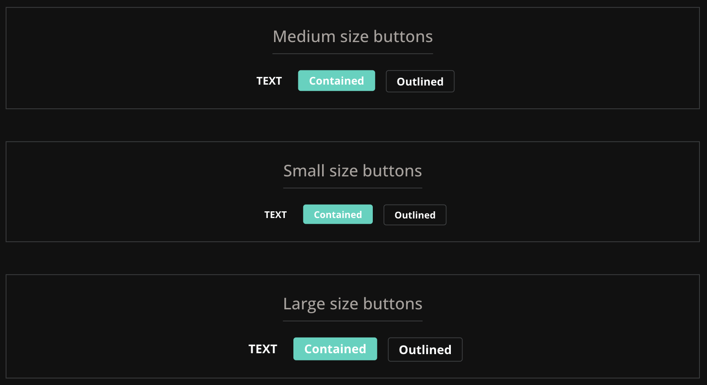

# fastn-button

fastn buttons are developed using [fastn language](https://fastn.com/). To achieve fastn champion badge I have developed these buttons taking UI inspiration from [Matrrial UI](https://mui.com/material-ui/react-button/).

# Overview

Buttons allow users to take actions, and make choices, with a single tap.

Buttons communicate actions that users can take. They are typically placed
throughout your UI, in places like:

- Modal windows
- Forms
- Cards
- Toolbars

These fastn buttons are inspired from [Matrrial UI](https://mui.com/material-ui/react-button/) and uses fastn typography and color tokens. 

# Preview

## Liked my work? 
- Give me a star on GitHub
- Connect with me on [Linkedin](https://www.linkedin.com/in/ganesh-s-891174ab/)

## fastn Champions program

[Click here](https://fastn.com/champion-program/) to learn how to became fastn champion.

## fastn and Curious?

Discover more of fastn here.

- [Expander Crash Course](https://fastn.com/expander/)
- [Video Tutorials](https://fastn.com/expander/hello-world/-/build/)
- [Explore more Templates/ Components/ Package](https://fastn.com/featured/)

## Become a fastn Contributor

1.  Finish the [Expander Crash Course](https://fastn.com/expander/)
2.  Share your progress and ideas on fastn [Discord](https://discord.gg/bucrdvptYd).
3.  Let fastn team guide you on your contributor journey.

## Become a fastn-trailblazer

- [Join fastn Discord Server](https://discord.gg/bucrdvptYd) to connect with other fastn enthusiasts and stay up to date with the latest developments.
- [Star them on GitHub](https://github.com/fastn-stack/fastn/)
